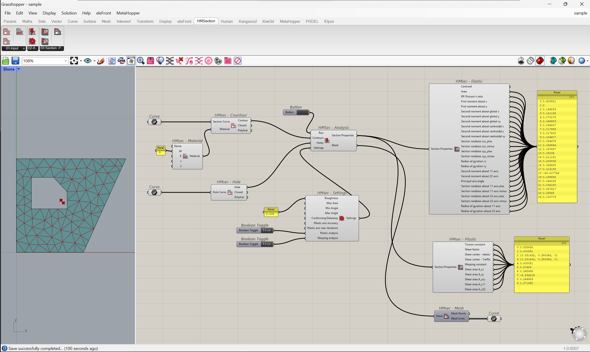

# <picture>  </picture> HMSection 

HMSection is a grasshopper plugin for the analysis of cross-sections. Uses CrossSection.net (https://github.com/IbrahimFahdah/CrossSection.Net) prackage that is based on python package sectionproperties (https://github.com/robbievanleeuwen/section-properties).

# Usage

Section is build from closed polyline curves with `HMSec - Contour component` .
 Contour can have holes in them, use `HMSec - Hole` component to create. 

Main analaysis takes place in `HMSec - Analysis component`. This component need analysis settings componnent to be connected. With this component mesh properties can be controled by roughness and angle properties. By default only elastic analysis is performed due to performance cost of warping and plastic analysis.

Output of analysis can be viewed by `HMSec - Elastic` and `HMSec - plastic components`. Mesh can be visualized by `HMSec - Mesh component`.

<picture>
    
</picture>

# Restrictions

- contour must be an closed polyline
- plugin projects 3d polyline on to the XY world plane and takes in calculation only the X and Y coordinates
- holes can´t be touching contours
- hole can be only in one contour, can´t overlap in to other contours

# Disclaimer

- the results were not properly validated, it remains user´s responsibility to confirm and accept the output.
- compound sections (made from multiple contours) seem to be bit buggy and may not always work

# Acknowledgments

- https://github.com/IbrahimFahdah/CrossSection.Net
- https://github.com/robbievanleeuwen/section-properties
- https://github.com/ParametricCamp/TutorialFiles
